---
tags:
  - 密码协议
  - 期末复习
  - Obsidian
---

# 密码协议期末复习 - Obsidian 视觉版

> 使用方式：在 Obsidian 中直接打开本文件。Mermaid 图、折叠块、表格、公式和本地 SVG 动画都可以作为复习入口。  
> 配套文字版：[[密码协议期末考试冲刺版]]、[[密码协议期末复习梳理]]

## 0. 复习总览

> [!summary] 这门课的考试主线
> 期末不是考“背算法名称”，而是考你能不能把密码组件放进协议场景里分析：谁认证谁、密钥怎么来、消息是否新鲜、身份是否绑定、攻击者能不能重放或离线猜口令。

### 缩写全称速查

| 缩写 | 全称 | 中文理解 |
|---|---|---|
| DH | Diffie-Hellman Key Exchange | Diffie-Hellman 密钥交换 |
| MITM | Man-in-the-Middle Attack | 中间人攻击 |
| ZKP | Zero-Knowledge Proof | 零知识证明 |
| NIZK | Non-Interactive Zero-Knowledge Proof | 非交互式零知识证明 |
| FS | Fiat-Shamir Transform | Fiat-Shamir 变换 |
| HMQV | Hashed Menezes-Qu-Vanstone Protocol | 带 Hash 身份绑定的 MQV 密钥交换 |
| MQV | Menezes-Qu-Vanstone Protocol | MQV 认证密钥交换协议 |
| NS | Needham-Schroeder Protocol | Needham-Schroeder 认证协议 |
| PAKE | Password-Authenticated Key Exchange | 口令认证密钥交换 |
| EKE | Encrypted Key Exchange | 加密密钥交换 |
| SPEKE | Simple Password Exponential Key Exchange | 简单口令指数密钥交换 |
| SRP | Secure Remote Password | 安全远程口令协议 |
| OPAQUE | OPAQUE aPAKE Protocol | OPAQUE 非对称口令认证密钥交换协议 |
| RSA-GPAKE | RSA-based Gateway Password-Authenticated Key Exchange | 基于 RSA 的网关口令认证密钥交换 |
| TLS | Transport Layer Security | 传输层安全协议 |
| SSL | Secure Sockets Layer | 安全套接字层 |
| MAC | Message Authentication Code | 消息认证码 |
| HMAC | Keyed-Hash Message Authentication Code | 带密钥的 Hash 消息认证码 |
| UKS | Unknown Key-Share Attack | 未知密钥共享攻击 |
| KDF | Key Derivation Function | 密钥派生函数 |

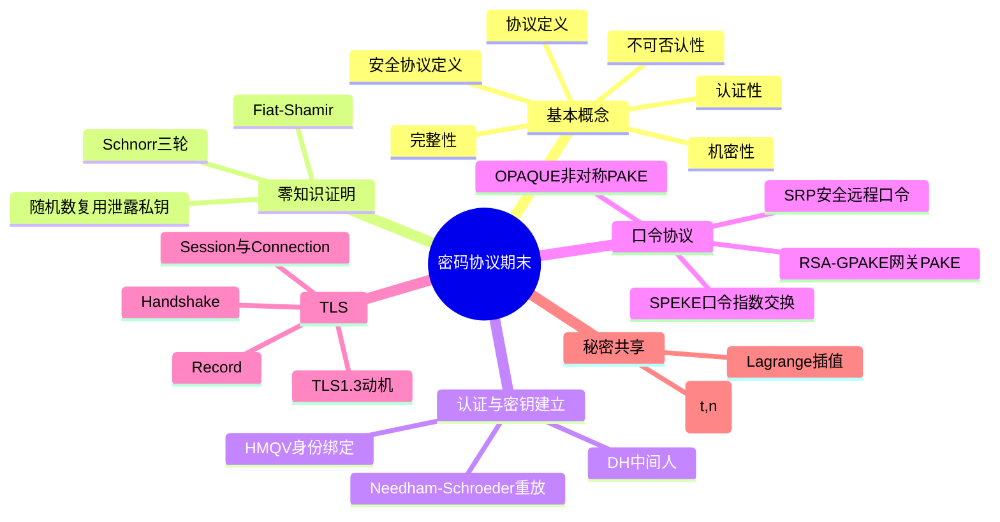

### 高频题型定位

| 题型 | 重点 | 复习动作 |
|---|---|---|
| 选择题 | 基本概念、协议性质、TLS 分层、攻击类型 | 看表格和总图，确认概念边界 |
| 流程题 | Schnorr、Fiat-Shamir、SPEKE、TLS 握手 | 默画时序图 |
| 攻击分析题 | DH MITM、NS_v5、SRP oracle、RSA-GPAKE 分离攻击 | 写“攻击流程 -> 违反性质 -> 改进” |
| 计算题 | Shamir $(3,5)$ 构造与恢复 | 按模 $p$ 算 share 和插值 |
| 对比题 | HMQV 身份绑定、签名加密顺序、TLS1.2/1.3 | 用对比表答 |

## 1. 协议分析通用流程

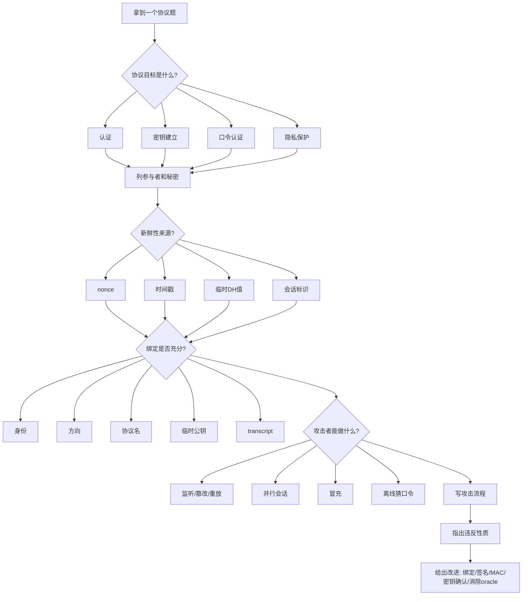

> [!tip] 考场固定句式
> 该协议的问题不是“用了某个算法所以不安全”，而是某个安全目标没有被协议消息明确绑定。答题时要写出绑定缺失在哪里。

## 2. Schnorr 零知识证明与 Fiat-Shamir

### 2.1 先理解 Schnorr：为什么需要三轮？

Schnorr 身份认证协议（Schnorr Identification Protocol）是一种典型的交互式零知识证明。它要解决的问题是：

> Alice 想证明“我知道公钥对应的私钥”，但不想把私钥告诉 Bob。

设 Alice 的私钥为 $x$，公钥为：

$$
Y=g^x
$$

Schnorr 的三轮结构是“承诺 -> 随机挑战 -> 响应”。其中第二轮的随机挑战很关键：它防止证明者先看题再编答案。

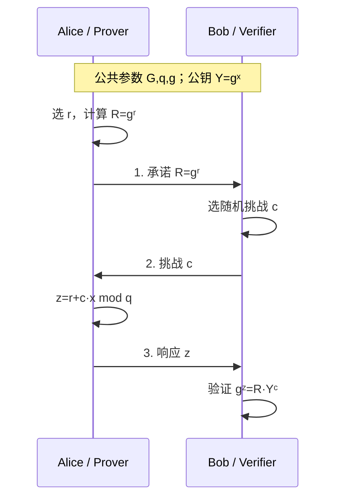

对应公式：

$$
R=g^r
$$

$$
z=r+c x \pmod q
$$

$$
g^z=R\cdot Y^c
$$

| 步骤 | 名称 | 作用 |
|---|---|---|
| $R=g^r$ | 承诺 | 先固定证明者的随机选择，防止看挑战后再伪造 |
| $c$ | 挑战 | 验证者提供随机性，是交互式证明的关键 |
| $z=r+cx$ | 响应 | 同时依赖随机数和私钥 |
| $g^z=R\cdot Y^c$ | 验证 | 检查响应是否与承诺、公钥一致 |

<details>
<summary>可直接背诵的正确性证明</summary>

因为 $Y=g^x$，且 $z=r+cx$，所以：

$$
g^z = g^{r+cx}=g^r(g^x)^c=R\cdot Y^c
$$

因此诚实证明者知道私钥 $x$ 时，验证一定通过。

</details>

### 2.2 随机数复用导致私钥泄露

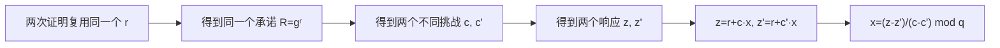

> [!danger] 结论
> Schnorr/ECDSA 这类协议中，临时随机数不是辅助细节。复用或泄露会直接导致私钥泄露。

公式：

$$
z=r+c x \pmod q
$$

$$
z'=r+c' x \pmod q
$$

$$
x=(z-z')(c-c')^{-1}\pmod q
$$

### 2.3 再问一步：三轮交互能不能改成一轮？

Schnorr 的三轮交互依赖 Bob 现场给出随机挑战。问题是：如果证明要写进区块链、签名文件、论文附录或一次性消息中，就没有 Bob 在线互动。  

Fiat-Shamir 变换（Fiat-Shamir Transform）解决的正是这个问题：用 Hash 函数生成挑战，把三轮交互压缩成一轮非交互式证明。

```mermaid
flowchart TB
    subgraph Interactive[交互式 Schnorr]
      I1[Alice发送 R=gʳ] --> I2[Bob随机选择 c]
      I2 --> I3[Alice发送 z=r+c·x]
    end

    subgraph NonInteractive[Fiat-Shamir 后]
      N1[Alice计算 R=gʳ] --> N2[c=H(g,Y,R,msg)]
      N2 --> N3[z=r+c·x]
      N3 --> N4["输出证明 π=(R,z)"]
    end

    Interactive -->|用 Hash 代替随机挑战| NonInteractive
```

公式：

$$
c=H(g,Y,R,\text{message},\text{context})
$$

$$
z=r+c x \pmod q
$$

| 项目 | 交互式 Schnorr | Fiat-Shamir 后 |
|---|---|---|
| 挑战来源 | 验证者随机发 $c$ | $c=H(\text{上下文},R)$ |
| 轮数 | 3 轮 | 1 轮 |
| 安全模型 | 交互式证明 | 随机预言机模型下的非交互式证明 |
| 答题关键词 | 随机挑战 | Hash 充当挑战者 |

## 3. Diffie-Hellman 中间人攻击

Diffie-Hellman Key Exchange（DH，Diffie-Hellman 密钥交换）的核心目标是让双方在公开信道上协商出共享密钥。基础 DH 的问题是：它只协商密钥，不认证“对面是谁”。

基础 DH 的消息可以写成：

$$
X=g^x,\quad Y=g^y,\quad K=g^{xy}
$$

### 3.1 动画流程


### 3.2 静态时序图

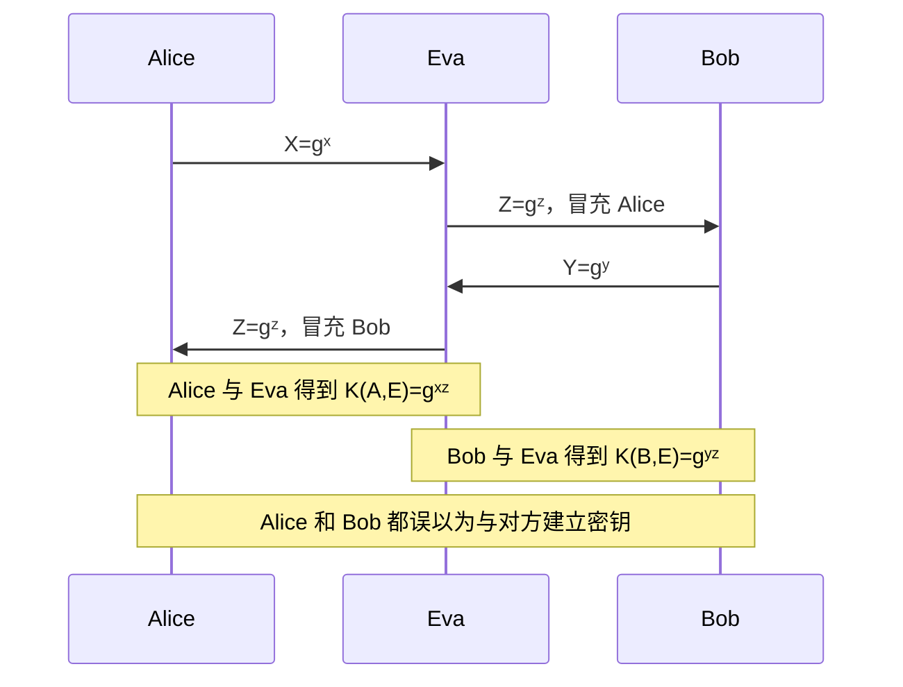

攻击中的两个实际密钥：

$$
K_{AE}=g^{xz}
$$

$$
K_{BE}=g^{yz}
$$

| 问题 | 答案 |
|---|---|
| 漏洞是什么 | 基础 DH 没有身份认证 |
| 违反什么性质 | 认证性，尤其是密钥归属认证 |
| 为什么不是单纯机密性问题 | Alice 和 Bob 各自的通信对 Eva 是可读的，但根因是对方身份未认证 |
| 怎么改进 | 对临时 DH 值签名，或将身份、长期密钥、临时公钥放入密钥派生 |

## 4. HMQV 身份绑定

HMQV 全称是 Hashed Menezes-Qu-Vanstone Protocol。它是在 MQV（Menezes-Qu-Vanstone Protocol）思想上加入 Hash 绑定的认证密钥交换协议。

这一题的逻辑是：DH 的问题是没认证身份，那么 HMQV 如何把“身份”放进密钥计算？答案就是把身份和临时公钥一起 Hash。

### 4.1 绑定关系图

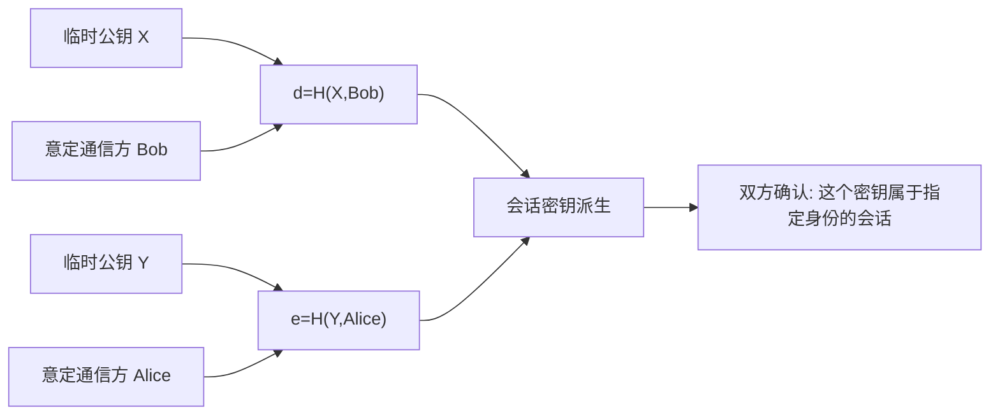

对应公式：

$$
d=H(X,\text{Bob})
$$

$$
e=H(Y,\text{Alice})
$$

### 4.2 如果去掉身份

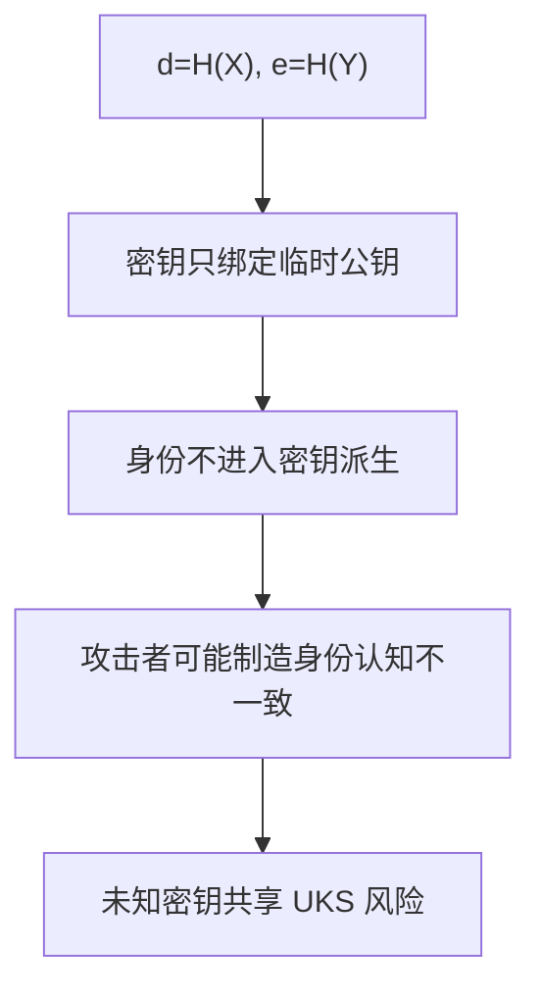

错误改法：

$$
d=H(X),\quad e=H(Y)
$$

| 写法 | 是否绑定身份 | 风险 |
|---|---:|---|
| $d=H(X,\text{Bob}), e=H(Y,\text{Alice})$ | 是 | 抗 UKS，密钥归属明确 |
| $d=H(X), e=H(Y)$ | 否 | 可能共享同一密钥但对端身份认知不一致 |

<details>
<summary>背诵版答案</summary>

HMQV 把意定通信方身份放入 Hash，是为了把临时公钥和对端身份一起绑定到密钥派生中，防止未知密钥共享攻击和身份误绑定。如果改成只对 $X,Y$ Hash，身份不参与密钥计算，攻击者可能使双方共享同一密钥但对密钥归属对象认识不一致，因此存在安全缺陷。

</details>

## 5. Needham-Schroeder 版本演化与 NS_v5 攻击

### 5.1 版本演化表

| 版本 | 改动 | 仍然存在的问题 |
|---|---|---|
| NS_v0 | 明文传输 | 可窃听、伪造、中间人 |
| NS_v1 | 加密消息 | 通信对象身份绑定不足，仍可 MITM |
| NS_v2 | 服务器反馈中加入通信对象身份 | 旧消息仍可能被重放 |
| NS_v3 | 加入 nonce 挑战应答 | 旧会话材料仍可被利用 |
| NS_v4 | 进一步把 nonce 放入 A-B 消息 | 仍可重放旧消息 |
| NS_v5 | 进一步保护 $N_A$ | 旧会话密钥泄露后仍可重放 |
| NS_v6 | 消息 3、5 使用 $h(N_B),h(N_A)$ | 旧认证材料仍可能被重放 |

### 5.2 NS_v5 重放攻击

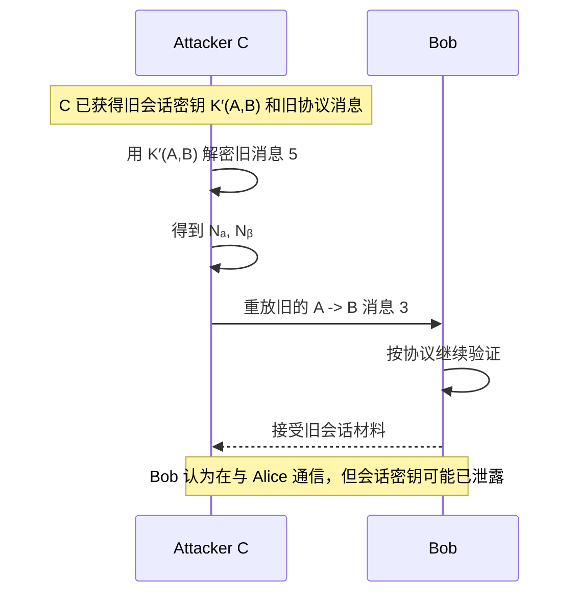

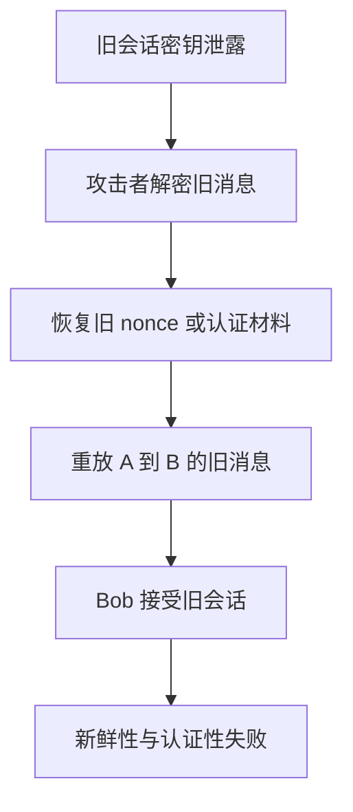

> [!important] NS 类题目的答题重点
> 不能只说“用了 nonce 所以安全”。要检查 nonce 是否与当前会话、身份、方向、会话密钥绑定。旧密钥泄露后仍能重放，说明新鲜性绑定不足。

## 6. SPEKE

SPEKE 全称是 Simple Password Exponential Key Exchange，即“简单口令指数密钥交换”。它属于 PAKE（Password-Authenticated Key Exchange，口令认证密钥交换）：双方只共享低熵口令，但希望协商出高熵会话密钥，并抵抗离线口令猜测。

### 6.1 为什么 $g=s^2 \bmod p$

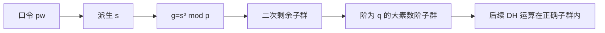

公式：

$$
p=2q+1
$$

$$
g=s^2 \bmod p
$$

| 条件 | 含义 |
|---|---|
| $p=2q+1$ | 安全素数 |
| $g=s^2 \bmod p$ | 把口令派生元素映射进二次剩余子群 |
| 目的 | 避免小子群/错误阶问题 |

### 6.2 改进 SPEKE 流程

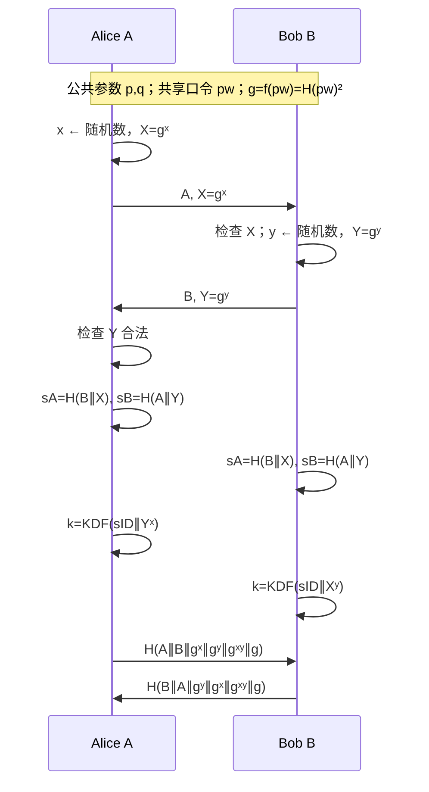

关键公式：

$$
g=f(pw)=H(pw)^2
$$

$$
X=g^x,\quad Y=g^y
$$

$$
s_A=H(B\parallel X),\quad s_B=H(A\parallel Y)
$$

$$
sID=\max(s_A,s_B)\parallel \min(s_A,s_B)
$$

$$
k_A=\operatorname{KDF}(sID\parallel Y^x),\quad k_B=\operatorname{KDF}(sID\parallel X^y)
$$

因为：

$$
Y^x=(g^y)^x=g^{xy}=(g^x)^y=X^y
$$

所以双方得到同一会话密钥。

### 6.3 认证消息不能调换

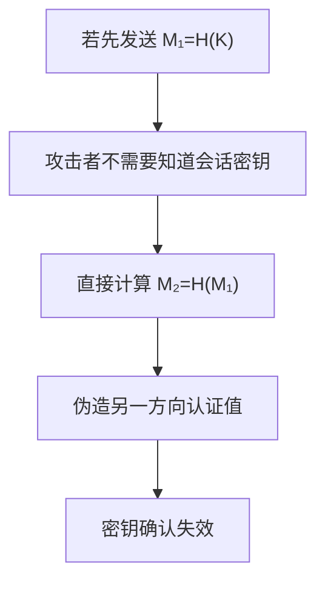

例如，如果错误设计成第一条发送：

$$
M_1=H(K)
$$

第二条发送：

$$
M_2=H(M_1)
$$

攻击者看到 $M_1$ 后，即使不知道 $K$，也能计算 $M_2$。

> [!warning] 答题关键
> 认证消息的顺序和方向绑定用于证明双方确实知道会话密钥。若一条消息能由另一条直接计算得到，则攻击者可能不掌握密钥也通过认证。

### 6.4 SPEKE 平行会话攻击为什么不是彻底成功

| 判断点 | 结论 |
|---|---|
| 攻击者能否利用并行会话通过某些认证检查 | 能 |
| 攻击者能否得到最终会话密钥 | 不能 |
| 是否彻底成功 | 不是 |
| 本质问题 | 认证/密钥确认不完美，而不是会话密钥完全泄露 |

## 7. SRP 三轮优化：password oracle

### 7.1 动画流程


### 7.2 攻击流程图

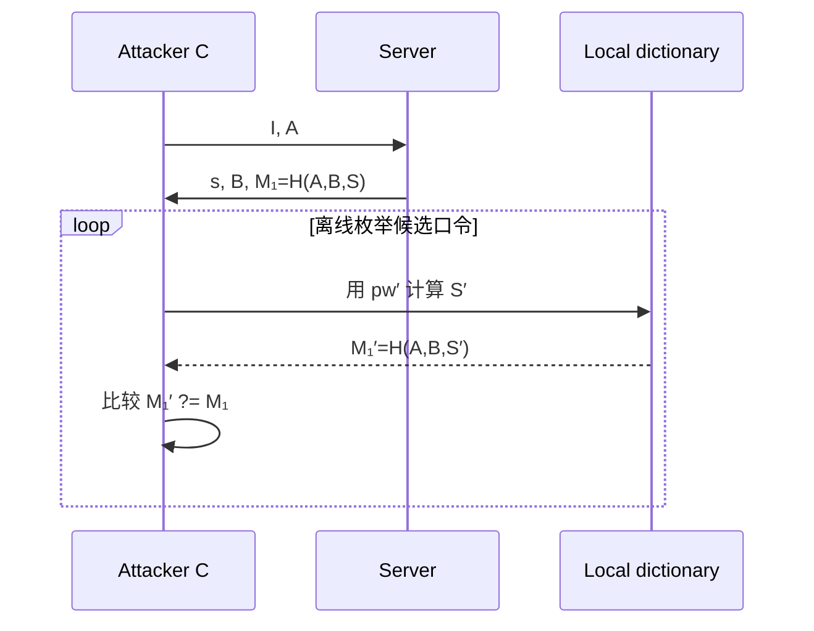

服务器提前返回：

$$
M_1=H(A,B,S)
$$

攻击者对候选口令 $pw'$ 计算：

$$
M_1'=H(A,B,S')
$$

并检查：

$$
M_1'\stackrel{?}=M_1
$$

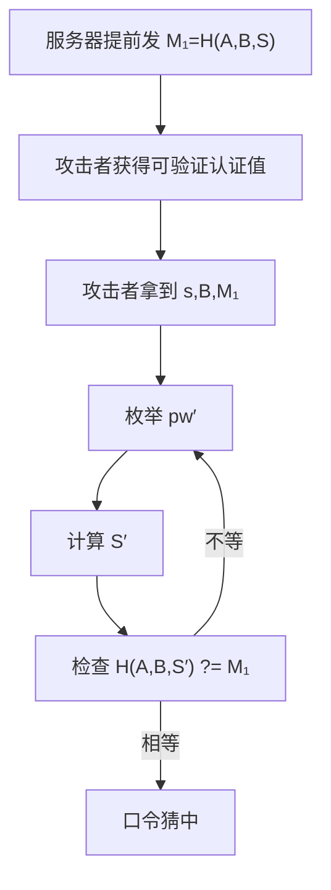

| 问题 | 说明 |
|---|---|
| 漏洞根因 | 服务器在客户端证明口令知识前发送可验证的 $M_1$ |
| 攻击类型 | 离线口令猜测 |
| 服务器角色 | password oracle |
| 改进 | 调整密钥确认顺序，不提前暴露可离线验证值 |

## 8. RSA-GPAKE 分离攻击

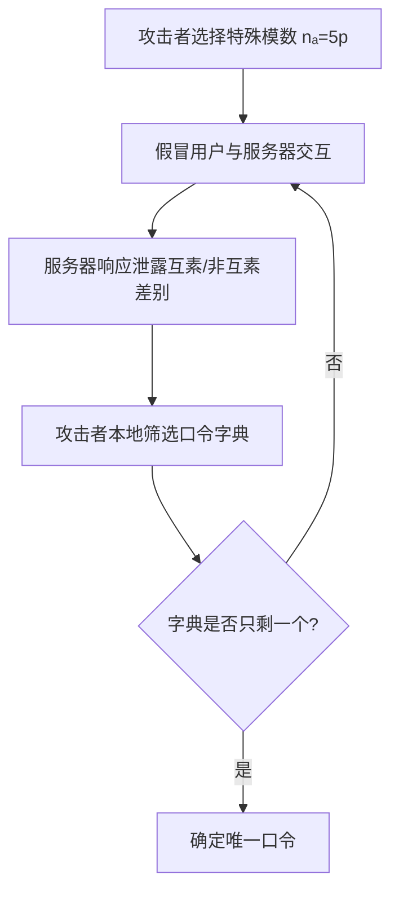

### 8.1 计算卡片

| 条件 | 数值 |
|---|---:|
| 攻击者发送 | $n_A=5p$ |
| 每次大约排除 | $1/5$ 口令 |
| 每次剩余比例 | $4/5$ |
| 字典大小 | $10^6$ |
| 需要次数 | $10^6(4/5)^t \le 1$ |
| 结果 | $t \approx 62$ |

$$
10^6\left(\frac45\right)^t\le 1
$$

$$
t\ge \frac{\log(10^{-6})}{\log(4/5)}\approx 62
$$

### 8.2 防御总结

| 防御 | 作用 |
|---|---|
| 禁止模数含小素因子 | 防止构造分离条件 |
| 限制总假冒会话次数 | 降低反复筛选能力 |
| 限制连续失败次数 | 抑制在线探测 |
| 不直接拒绝，返回随机值 | 消除确定性 oracle |

## 9. Shamir $(t,n)$ 门限方案

### 9.1 构造流程

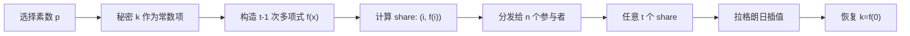

### 9.2 往届题例：$(3,5), p=17, k=13$

选一个二次多项式：

$$
f(x)=4x^2+3x+13 \pmod {17}
$$

生成 share：

| $i$ | $f(i)$ 计算 | share |
|---:|---|---|
| 1 | $4+3+13=20\equiv3$ | $(1,3)$ |
| 2 | $16+6+13=35\equiv1$ | $(2,1)$ |
| 3 | $36+9+13=58\equiv7$ | $(3,7)$ |
| 4 | $64+12+13=89\equiv4$ | $(4,4)$ |
| 5 | $100+15+13=128\equiv9$ | $(5,9)$ |

用前三个恢复时，在 $x=0$ 的拉格朗日系数：

| 点 | $\lambda_i(0)$ |
|---|---:|
| $x=1$ | $3$ |
| $x=2$ | $14$ |
| $x=3$ | $1$ |

恢复：

$$
k=3\cdot3+1\cdot14+7\cdot1=30\equiv13 \pmod {17}
$$

> [!tip] 计算题检查点
> $t=3$ 就用二次多项式；常数项必须是秘密 $k$；所有运算都要 $\bmod p$。

## 10. TLS/SSL 结构图

### 10.1 协议分层

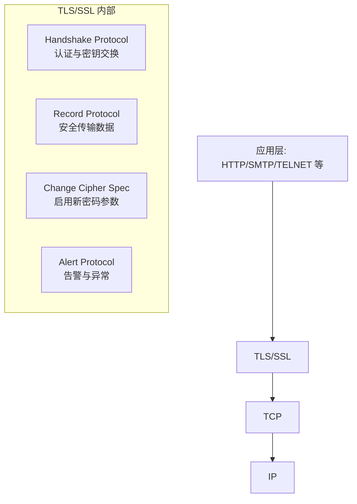

### 10.2 TLS 典型握手

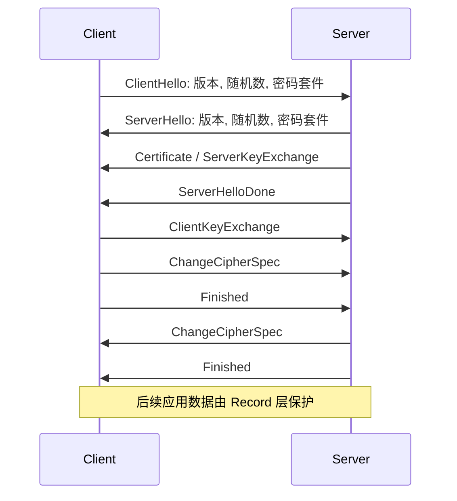

### 10.3 TLS 1.2 vs TLS 1.3

| 维度 | TLS 1.2/更早设计 | TLS 1.3 改进方向 |
|---|---|---|
| 密钥交换 | 支持 RSA 密钥传输 | 默认使用 DH/ECDHE，提供前向安全 |
| 加密模式 | 可能使用 CBC、RC4 等旧机制 | 移除不安全算法 |
| Hash | 旧版本历史上涉及 MD5/SHA-1 | 使用更现代的 Hash/KDF |
| 握手轮次 | 通常更多 | 1-RTT，部分场景 0-RTT |
| 安全动机 | 易受 BEAST、Lucky13、FREAK、LogJam 等影响 | 简化协议，减少历史攻击面 |

## 11. 先签名后加密 vs 先加密后签名

```mermaid
flowchart LR
    M[消息 M] --> S1[先签名 Sig(A,M)]
    S1 --> E1[再加密 Enc(B,M,Sig)]
    E1 --> R1[接收方解密后验证]

    M --> E2[先加密 Enc(B,M)]
    E2 --> S2[再签名 Sig(A,C)]
    S2 --> R2[第三方可验证密文签名]
```

| 方案 | 优点 | 缺点 | 作业口径 |
|---|---|---|---|
| 先签名后加密 | 同时提供机密性和认证性；更常见 | 不公开验证；接收方解密后才能验证 | 实践中更倾向 |
| 先加密后签名 | 可公开验证密文；效率较高 | 若不绑定发送方身份，可能被替换外层签名 | 不是必然不安全，关键看绑定 |

## 12. 最后复习路线

```mermaid
flowchart TD
    A[第一轮: 看总图和高频表] --> B[第二轮: 默画 5 个流程]
    B --> C[Schnorr]
    B --> D[DH MITM]
    B --> E[SPEKE]
    B --> F[SRP oracle]
    B --> G[TLS 握手]
    C --> H[第三轮: 背 7 类大题模板]
    D --> H
    E --> H
    F --> H
    G --> H
    H --> I[第四轮: 做 Shamir 计算]
    I --> J[第五轮: 选择题概念辨析]
```

### 考前 30 分钟只看这些

- 协议/安全协议定义，四个安全性质。
- 攻击手段至少 8 个。
- Schnorr 三轮和 Fiat-Shamir。
- NS_v5 重放攻击。
- SPEKE 平方目的、改进流程、认证消息不能调换。
- HMQV 身份绑定。
- Shamir $(3,5),p=17,k=13$ 例题。
- TLS 四个子协议、Session/Connection、TLS1.3 动机。

